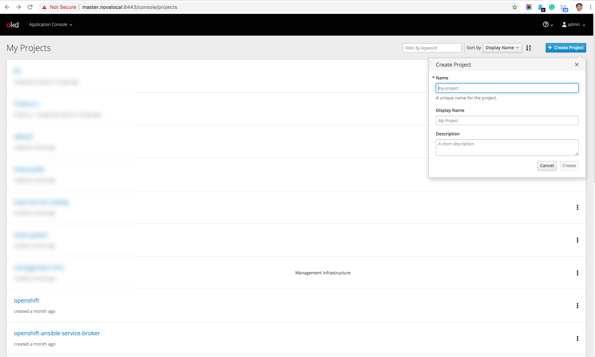
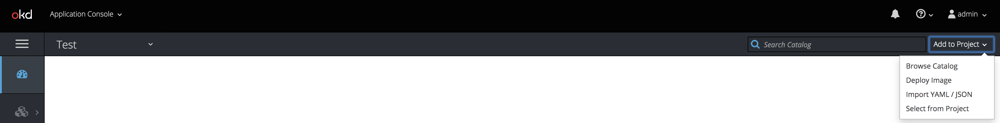
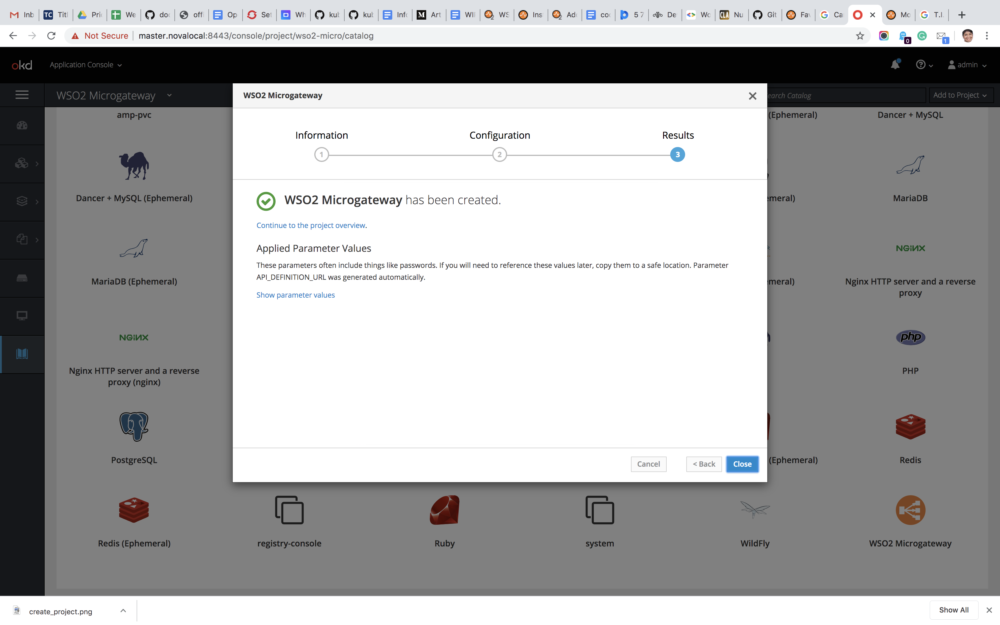
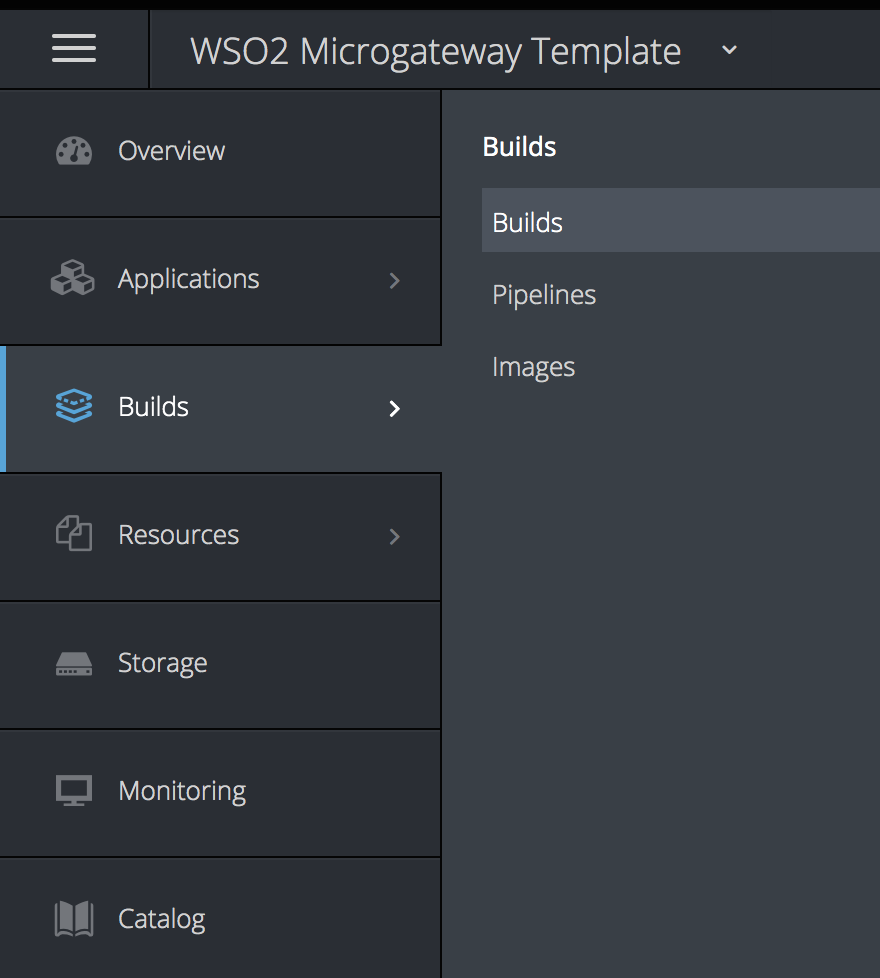
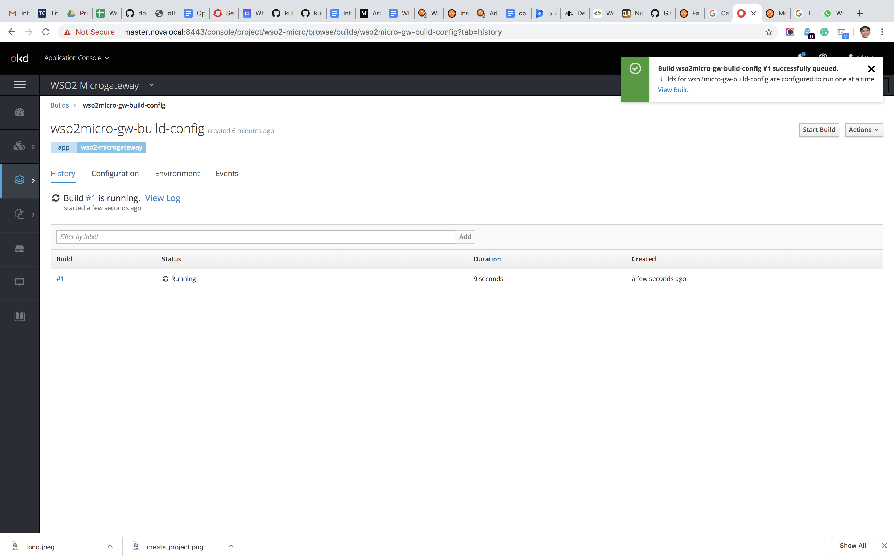

## **OpenShift Resources for WSO2 API Microgateway**

## **Contents**

- Prerequisite
- Quick Start Guide
- Add your own API definition
  - Using local OpenAPI 3 definition file
  - Using OpenAPI 3 definition file hosted on GitHub
  - Using Docker image
- Enable centralized logging with Logstash

## **Prerequisite**

In order to use WSO2 [Updates](https://wso2.com/updates) for a specific product, you need an active [WSO2 Subscription](https://wso2.com/subscription). To sign up for a WSO2 Free Trial Subscription click [here](https://wso2.com/subscription/free-trial).

A running OpenShift Cluster (these resources have been tested on [OpenShift](https://www.okd.io/)[OKD](https://www.okd.io/) version 3.11.

When a new Openshift user account is create the user account should be granted the following cluster role by the Openshift admin

- system:deployers
- system:image-builders
- system:image-pullers
- system:build-strategy-custom

Minimum system requirements needed for a successful deployment of WSO2 Microgateway is as follows

|Memory             :| 256 Mb        |
| ------------------:| -------------:|    
| Cores             :|2              |

## **Quick Start Guide**

This Quick Start Guide is based on WSO2 API Microgateway documentation (Version 3.0.2.) You can read more about the WSO2 API Microgateway [here](https://docs.wso2.com/display/MG300/Quick+Start+Guide). The &quot;petstore&quot; API, petstore OpenAPI 3 definition guild can be referred [here](https://github.com/wso2/product-microgateway/blob/master/samples/petstore_basic.yaml)

1. After creating the Openshift cluster, login with your cluster credentials and choose the **Application console** from the left top drop down next to the OKD logo

    
 
2. Create your own project

    
 
3. Click on the created project and follow the steps mentioned in below:

    
 
    - In the right corner, click Add to project → Import YAML/JSON.
    - The user will see a text editor section, so that he/she can paste the template content here and click on `create`button

    
    - Click on save template option on the pop-up that is displayed next and click on `continue`
    - When the popup window closes, click on the `Catalog` menu on the black panel on the right-side
    - Look for the `WSO2 Microgateway` icon and open it by clicking.

       
    - The **`Information` tab** gives a brief description on the product.

    
 
    - Click on`Next`and open the **`Configuration`tab**

    

    Here you have the ability to try with different configuration settings.

    - **Name** - Give a name to the deployment resources.Naming convention  Permit characters - [a-z][0-9] and hyphen (-)
    - **Set the project name** - Give a name to your project and  use only [a-z] for the name. Read the documentation for more information [here](https://docs.wso2.com/display/MG300/Quick+Start+Guide).

    - **URL of the API definition eg-http(s)://<domain>** - able to leave this field blank.
        Add space separated list of file names if you have multiple files. You can keep the field blank to download all the yaml files in the location.
    - **Git Repository URL(Optional)**: user may  leave the default value for this field

    - **Git Repository Branch name. Eg- Master(Optional)**:user may  leave the default value for this field

    - **Optional subdirectory for the application source code** - can add a`/`

4. Complete  the wizard by clicking on the `Create`button.

    
 
5. Thereafter navigate to `Builds`from the side navigation bar.

   
 
   Then  you can see the build configuration and start the build manually by clicking the `name`. Next click on `Start build`

   
 
   
 
6. Once the deployment is successful, you can access the API with the routers url.

 
 
## **Add your own API definition**

  1. **Local OpenAPI 3 definition file**
    Write your API definition file[Refer the following link when creating [https://github.com/wso2/product-microgateway/tree/master/samples](https://github.com/wso2/product-microgateway/tree/master/samples)]. Keep in mind to comply with [OpenAPI 3 standards](https://swagger.io/blog/news/whats-new-in-openapi-3-0/) while you write  your own  api definition file.
   Host the API definition file  in file server  where OpenShift will be  able to download the definition \*.yaml while running the build.  Get a git clone of
   `WSO2 API Microgateway` . The user is able to see the `templete.yaml` file in the cloned location. Next navigate to the cloned location and open the templete.yaml file. 
   Search the templete.yaml for `API_DEFINITION_URL` field and make the required changes to reflect the URL of your API definition host location.
   At this point If you haven't  already  followed the Quick Start Guide continue following the instructions.

  2. **OpenAPI 3 definition file hosted on GitHub**
        1. Write your API definition file[Refer the folowing link when creating [https://github.com/wso2/product-microgateway/tree/master/samples](https://github.com/wso2/product-microgateway/tree/master/samples)].. Use [OpenAPI 3 standards](https://swagger.io/blog/news/whats-new-in-openapi-3-0/) while you write the api definition file.
        2. Push the API definition file to  your  GitHub repository.
        3. change the GitHub repository URL and the GitHub repository branch parameters [these parameters are in the **configuration tab** in Quick Start guide]when your deploying the catalog &quot;WSO2 Microgateway&quot;

  3. **Use private Docker image**
        1. Follow the steps in [this](https://docs.wso2.com/display/MG300/Quick+Start+Guide+-+Docker) documentation to create a Docker image. Push the created Docker image to a private Docker repository. Use the Microgateway tool kit 3.0.2  to create the Docker image.
        2. Edit the OpenShift template you downloaded using git
        3. Comment the  configurations of line`Comment this section if you use private docker image` and uncomment the lines from `Uncomment this section if you use private docker image`
        4. Include your private docker registry URL to line 320. Add the template to OpenShift and deploy[Refer Quick Start Guide section].

## **Enable centralized logging with logstash.**

In order to enable centralized logging, you need to have a working [logstash cluster](https://www.elastic.co/guide/en/logstash/current/installing-logstash.html)[.](https://www.elastic.co/guide/en/logstash/current/installing-logstash.html)

  1. uncomment the lines following the heading `Uncomment this section if you use logstash cluster`
  2. Change the default parameter values
LOGSTASH\_IP\_URL, LOGSTASH\_PORT, LOSTASH\_USERNAME, LOGSTASH\_PASSWORD
  3. Add the template to OpenShift  And thereafter follow the Quick Start Guild progressively